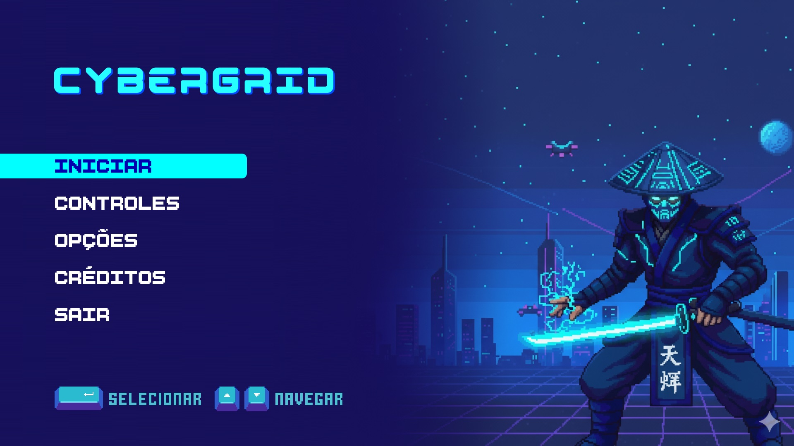
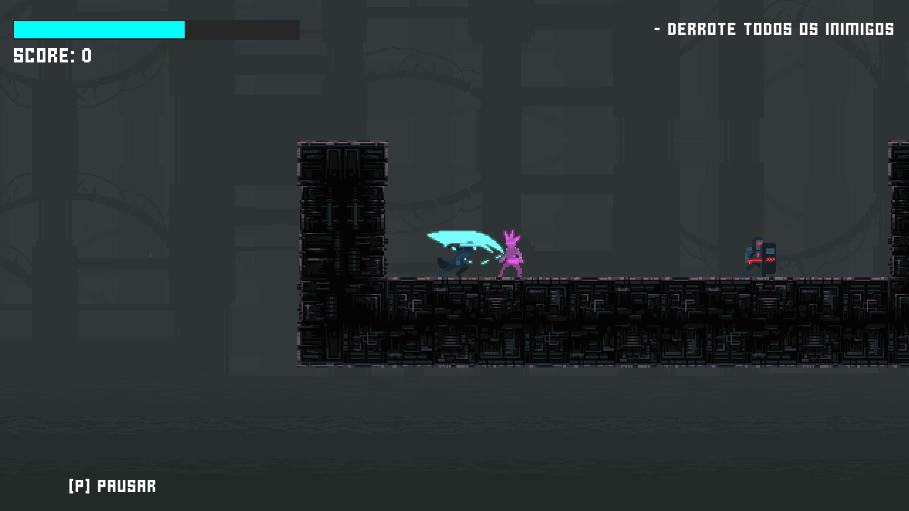

# Cybergrid

Este repositório contém o código-fonte do projeto **Cybergrid**, um **jogo digital 2D de plataforma e ação**, desenvolvido como parte do **Trabalho de Conclusão de Curso (TCC)** no curso de **Ciência da Computação**, com foco no estudo da **dificuldade adaptativa em jogos digitais e seu impacto no engajamento do jogador**.

O objetivo principal deste projeto é explorar e demonstrar, em nível de código, a implementação de um sistema de ajuste dinâmico de dificuldade (*Dynamic Difficulty Adjustment*), aplicado a um jogo real, funcional e testado com jogadores.

> ⚠️ Importante: este repositório disponibiliza apenas o código-fonte do projeto. Os assets gráficos e visuais não estão incluídos, pois alguns dos assets utilizados são pagos e a redistribuição dos mesmos não é permitida.

## 🧠 Contexto e Motivação

Manter o jogador engajado ao longo de uma experiência de jogo está diretamente relacionado ao equilíbrio entre **desafio** e **habilidade**, conforme descrito pela **Teoria do Flow**. Sistemas tradicionais de dificuldade fixa (“fácil”, “normal”, “difícil”) nem sempre conseguem atender adequadamente jogadores com perfis, ritmos de aprendizado e níveis de experiência distintos.

Diante disso, este projeto investiga o uso de **dificuldade adaptativa**, na qual o próprio jogo monitora o desempenho do jogador e ajusta dinamicamente o nível de desafio, buscando:

- reduzir frustração excessiva;
- evitar tédio causado por desafios triviais;
- manter o jogador próximo da chamada zona de flow.

O jogo foi desenvolvido especificamente para servir como **ambiente experimental**, permitindo observar e analisar o comportamento do sistema adaptativo aplicado a diferentes mecânicas de gameplay.

## 🕹️ Visão Geral do Jogo

O jogo é um plataforma 2D com elementos de ação, desenvolvido na **Godot Engine** (versão 4.4.1-*stable*), no qual o jogador enfrenta inimigos corpo a corpo e desafios de movimentação ao longo de diferentes fases.

Principais características:

- Estilo plataforma 2D com progressão por fases;
- Ênfase em **combate direto**, **defesa ativa (*parry*)** e **desafios de plataforma**;
- Sistema de pontuação baseado em desempenho;
- Duas abordagens de dificuldade:
    - dificuldade fixa (grupo de controle);
    - dificuldade adaptativa (objeto de estudo).

## ⚔️ Mecânicas Principais

O núcleo do gameplay é composto por três mecânicas centrais:

### 🗡️ Combate

- Ataques corpo a corpo com arma de curto alcance;
- Possibilidade de pequenos combos;
- Ênfase em tempo de reação e posicionamento.

### 🛡️ Parry

- O jogador pode aparar ataques inimigos ao sincronizar corretamente a defesa;
- Um parry bem-sucedido abre uma janela para contra-ataque;
- Derrotas logo após um parry rendem bônus de pontuação, incentivando o uso da mecânica.

### 🧗 Plataforma

- Plataformas móveis e obstáculos temporizados;
- Paredes de laser que alternam entre estados ativos e inativos;
- Exigem precisão, leitura de padrões e controle de tempo.

## 👾 Inimigos

O jogo conta com dois tipos principais de inimigos, cada um com comportamentos distintos:

### Punk

- Ataques mais rápidos;
- Menor dano;
- Pressiona reflexos do jogador.

### Riot

- Ataques mais lentos, porém mais fortes;
- Pode utilizar escudo defensivo;
- Exige estratégias mais cuidadosas de aproximação e timing.

## 🧩 Estrutura das Fases

O jogo é composto por seis fases, organizadas da seguinte forma:

- **Fases de Tutorial (3):** Cada fase introduz e isola uma mecânica específica, além de servirem para coletar métricas iniciais de desempenho do jogador:
    - Combate;
    - Parry;
    - Plataforma.

- **Fases Principais (3)**:
    - Combinam todas as mecânicas simultaneamente;
    - Representam o principal campo de atuação do sistema de dificuldade adaptativa;
    - Utilizadas para análise comparativa entre dificuldade fixa e adaptativa.

## 📊 Sistema de Dificuldade Adaptativa

A versão adaptativa do jogo implementa um **algoritmo de ajuste dinâmico de dificuldade**, que monitora continuamente o desempenho do jogador com base em métricas específicas, tais como:

- desempenho em combate;
- eficiência no uso do parry;
- sucesso e falhas em desafios de plataforma.

Com base nesses dados, o sistema ajusta dinamicamente parâmetros referentes à agressividade dos inimigos e à velocidade de ataques e obstáculos.

## 🔬 Natureza Experimental

Este jogo **não foi desenvolvido como um produto comercial**, mas como um **protótipo experimental**, utilizado para:

- comparar versões com dificuldade fixa e adaptativa;
- coletar feedbacks quantitativos e qualitativos de jogadores;
- analisar impactos no engajamento, atenção e intenção de replay.

Os resultados obtidos indicaram maior retenção e atenção mantida na versão adaptativa, reforçando o potencial desse tipo de sistema quando bem calibrado.

## 📁 Sobre os Assets

Este repositório **não inclui**:

- sprites;
- tilesets;
- fontes;
- artes de interface;
- efeitos visuais.

Esses recursos foram obtidos a partir de assets pagos, licenciados apenas para uso no projeto original. O foco deste repositório é exclusivamente o **código, sua estrutura, lógica e implementação**.

## ▶️ Versões Jogáveis

Para fins de validação experimental e demonstração do projeto, o jogo foi disponibilizado em **duas versões distintas**, hospedadas na plataforma [itch.io](https://itch.io/) e executáveis diretamente no navegador. Essas versões foram utilizadas durante a etapa de testes com jogadores e representam abordagens diferentes de balanceamento de dificuldade:

- **Versão A (Com dificuldade fixa):** https://erik-abdala.itch.io/cybergrid-a
- **Versão B (Com dificuldade adaptativa):** https://erik-abdala.itch.io/cybergrid-b

## Créditos

Projeto desenvolvido como parte do **Trabalho de Conclusão de Curso (TCC)** em **Ciência da Computação** no **IFSULDEMINAS - Campus Muzambinho**, sob orientação do **Prof. Ricardo José Martins**.

**Engine:** Godot 4.4.1.stable

**Assets**:

- Artes do jogo por [Gemini](https://gemini.google.com/app);
- [Cyberpunk Samurai](https://gabry-corti.itch.io/cyberpunk-samurai) por [Gabry Corti](https://itch.io/profile/gabry-corti);
- [Riot Cop](https://gabry-corti.itch.io/riotcop) por [Gabry Corti](https://itch.io/profile/gabry-corti);
- [Punk](https://gabry-corti.itch.io/punk) por [Gabry Corti](https://itch.io/profile/gabry-corti);
- [Dark Platformer Complete](https://szadiart.itch.io/dark-platformer-complete) por [Szadi art](https://itch.io/profile/szadiart);
- [Pixel UI & HUD](https://deadrevolver.itch.io/pixel-ui-hud-pack) por [Dead Revolver](https://itch.io/profile/deadrevolver);
- [Pixel Keyboard & Mouse Controller Pack](https://deadrevolver.itch.io/pixel-keyboard-mouse-controller-pack) por [Dead Revolver](https://itch.io/profile/deadrevolver);
- [BoldPixels - Free Font](https://yukipixels.itch.io/boldpixels) por [Yūki](https://itch.io/profile/yukipixels);
- [Pixel font: Stacked pixel](https://monkopus.itch.io/stacked-pixel) por [monkopus](https://itch.io/profile/monkopus);
- [PHASED: A Pixel and Vector Font](https://little-martian.itch.io/phased-font) por [Little Martian](http://itch.io/profile/little-martian).